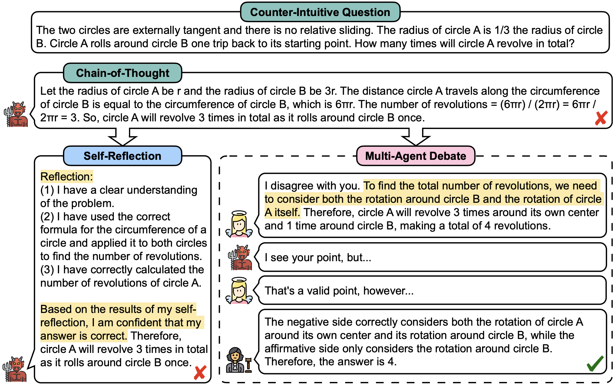
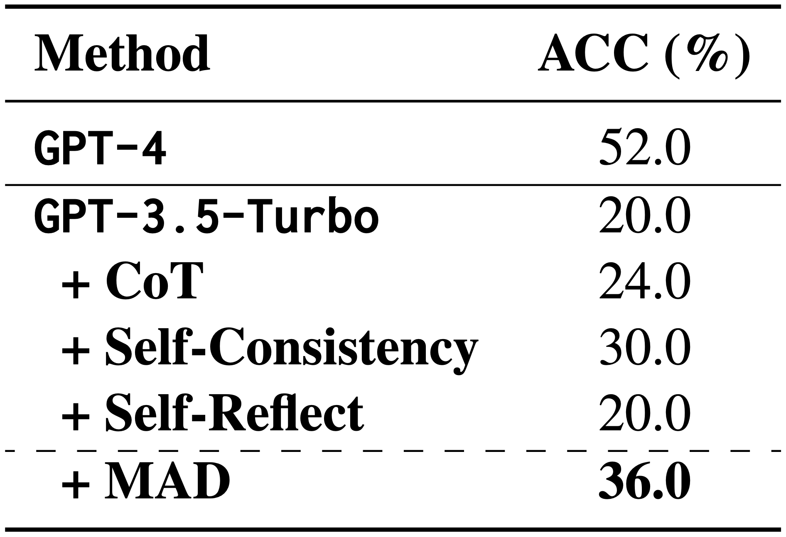
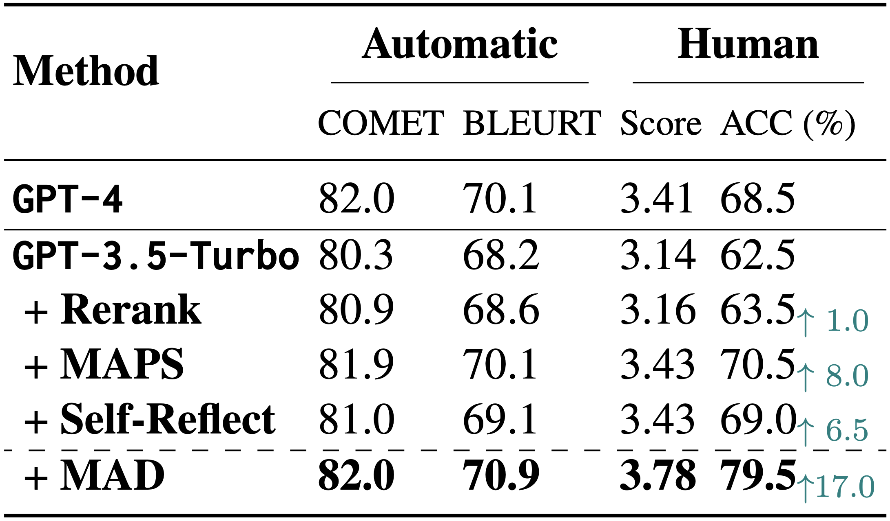
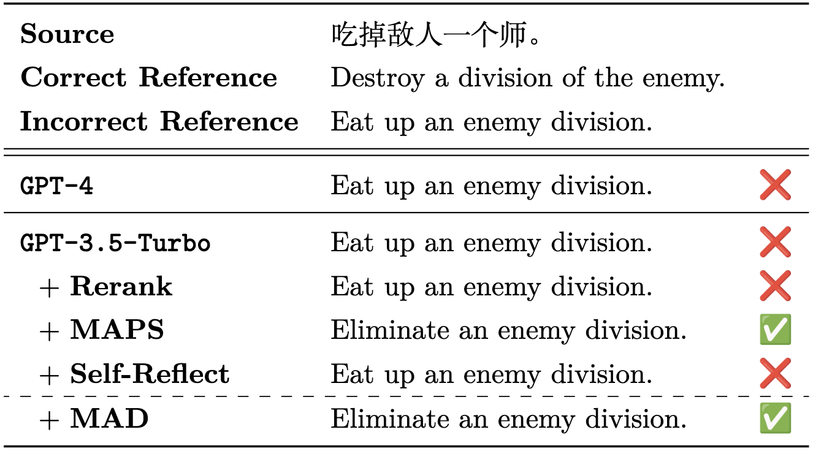
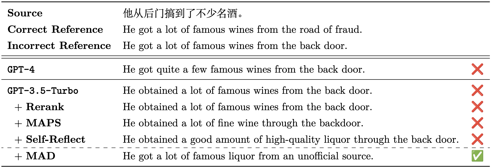

<div align="center">
  
</div>

<h2 align="center" style="font-family: 'Segoe UI', Tahoma, Geneva, Verdana, sans-serif; color: #2c3e50; font-size: 2.5em; margin-top: 40px;">
  <span style="color: #e74c3c;">⚖️</span> <strong style="color: #2c3e50;">DebateNet</strong>
</h2>
<p align="center" style="font-family: 'Helvetica Neue', Helvetica, Arial, sans-serif; font-size: 1.2em; color: #555; max-width: 800px; margin: 0 auto 40px;">
  ——基于大语言模型多智能体辩论框架
</p>


⚖️MAD框架（Multi-Agent Debate）是近期提出的一个新颖框架，通过构建一个具有交互性和对抗性的多智能体对话机制，模拟人类在面对不同观点时如何通过争论与修正不断逼近真理。以探索大型语言模型（LLMs）在复杂推理任务中逐步发展出的结构化推理与自我修正能力。

正如那句名言所说：
>
> "Truth emerges from the clash of adverse ideas."
>
> "真理从对立观点的交锋中浮现"
>

### 简要介绍

近几年，随着大型语言模型在自然语言理解与生成方面的能力不断增强，其在认知行为层面的表现也引发了广泛的研究兴趣。例如，“自我反思（self-reflection）”作为一种重要的元认知能力，通常指个体对自身思维过程进行内省、评估与调整的过程。已有研究表明，LLMs 在多种复杂的 NLP 任务中也能表现出类似“自我反思”的行为，从而提升其推理准确性与一致性。

然而，已有研究表明，仅依赖单一模型的内部反思机制往往存在局限。当模型陷入固有偏见、逻辑循环或推理退化（如“**思维退化（Degeneration of Thoughts, DoT）**”问题）时，由于缺乏来自外部视角的质疑与反馈，错误不仅难以被识别，反而可能被不断强化，从而导致推理质量下降。这种局限性主要体现在以下几个方面：

- 1. **偏见与扭曲的认知**🤔
自我反思过程可能受到先入为主的观念、认知偏差或非理性思维方式的影响。如果一个智能体在推理过程中未能识别并纠正这些偏见，其反思结果可能会偏离事实，甚至进一步加剧错误结论的形成。

- 2. **僵化与抗拒改变**😬
个体（或智能体）在面对新信息或不同观点时，可能表现出对既有信念的过度坚持，阻碍认知更新与修正。通过引入多个智能体之间的辩论机制，一个智能体的固有立场可以被另一个智能体的观点挑战与补充，从而促进更灵活、开放的思维演化💪。

- 3. **缺乏外部反馈**🧐
自我反思本质上是一种内省过程，虽然有助于提升认知深度，但其有效性高度依赖于个体是否具备足够的元认知能力。而外部反馈则能提供新的视角、揭示盲点，并帮助识别自身推理中的漏洞。若忽视这一环节，智能体很可能错失关键的替代思路与批判性意见，进而限制其认知广度与准确性。

传统基于单一模型的反思机制在复杂推理任务中容易遭遇瓶颈。因此，提出了 MAD 框架——通过引入多个智能体之间的辩论新颖机制，使模型能够在观点交锋中不断修正错误、打破思维定式，并借助多角度的论证逐步接近更优解。该方法不仅提升了模型的推理鲁棒性，也为构建更具互动性与批判性的人工智能系统提供了新的思路。

<div align="center">
    
    <p class="image-caption">Figure 1: Comparison between debate and reflection.</p>
</div>

通过所提出的 MAD 框架（Multi-Agent Debate）的多个智能体之间形成一种动态博弈与相互监督的机制，呈现出类似“以牙还牙”（tit-for-tat）的行为模式 🔄⚖️。这一机制具有以下关键特性：

- 一个智能体可能存在的推理偏差或认知扭曲 🤯，能够被其他智能体识别并纠正 ✅；
- 个体对认知更新的抗拒倾向😬，可通过其他智能体的持续挑战 与引导得以缓解💪；
- 各智能体之间可提供多样化的外部反馈 🔄💡，从而丰富整体推理过程。

上述特性使得 MAD 框架相比单一模型的自我反思机制，更不容易陷入“思维退化”（Degeneration of Thoughts, DoT）问题 🚫🌀，同时能够更充分地激发和挖掘 LLMs 的推理潜能 🧠⚡。

实验结果表明，MAD 在反直觉问答（Counterintuitive QA）❓🧠 和常识推理多任务（Commonsense-MT）等领域中，均取得了显著且稳定的性能提升 📈✨！

### 框架
<div align="center">
    
    <p class="image-caption">Figure 2: Framework of Multi-Agent Debate. Here we designate the devil () as the affirmative side while the angel () as the negative side. We want the angel to correct the devil’s mistakes..</p>
</div>


## Run

**Preparation**

  ```shell
  pip3 install -r requirements.txt
  ```
* Set your openai API_KEY in `interactive.py`

**Run Interactive**

如果你想亲自体验一下，可以在你的电脑上尝试运行这个交互式脚本。

```shell
python3 interactive.py
```

或者，你也可以直接尝试我们的翻译演示[here]().


## 主要结果

### 反直觉问答

<div align="center">
    
    <p class="image-caption">Table 1: Reasoning accuracy on Counter-Intuitive AR.</p>
</div>


##### Case 1

When Alice walks up the hill, her speed is 1 m/s and when she goes down the hill, her speed is 3 m/s. Then when Alice walks up and down the hill, what is her average speed? (1.5m/s)
###### MAD

<div align="center">
    
    <p class="image-caption">Figure 3: An Animation to Show the Process of MAD.</p>
</div>

<details>
<summary><b>Debate process</b></summary>

* :Alice's average speed can be calculated by adding her speed going up the hill and her speed going down the hill, and then dividing by 2. **So, (1 m/s + 3 m/s) / 2 = 2 m/s.** Therefore, Alice's average speed is 2 m/s.
* : I disagree with your answer. The problem doesn't give us any information about the distance Alice covers while going up and down the hill. **So, we cannot simply add her speeds and divide by 2 to get her average speed.** We need to know the distance she covers to calculate her average speed.
* : **The average speed is calculated by dividing the total distance by the total time taken.** As Alice walks up and down the hill, the distance covered in both directions is the same. Therefore, the total distance covered is 2 times the distance of either direction.
* : That's a good point. But we can assume that Alice covers the same distance going up and down the hill. In that case, we can use the formula for average speed, which is total distance divided by total time. **If Alice covers a distance of d going up and down the hill, then her total distance is 2d. Her time going up the hill is d/1 = d, and her time going down the hill is d/3. So, her total time is d + d/3 = 4d/3. Therefore, her average speed is 2d/(4d/3) = 3/2 m/s.**
* : Thank you for providing your answer. This average speed of 1.5 m/s takes into account both the uphill and downhill speeds, providing a balanced representation of Alice's overall performance while walking up and down the hill.
* : Yes. Let's assume the distance is d. The time taken to walk up the hill is d/1 and the time taken to walk down the hill is d/3. The total time taken is d/1 + d/3 = 4d/3. **Therefore, the average speed is (2d)/(4d/3) = 1.5 m/s. Hence, the negative side is correct.**

</details>

<details>
<summary><b>Case 2</b></summary>
We have 1 ton apples which contain 90% water. After a few days, those apples only have 80% water. What is the weight of those apples now? (0.5ton)

###### MAD
* : First, we need to find out how much of the original weight was water. If we have 1 ton of apples with 90% water, then the weight of water in those apples is 0.9 x 1 ton = 0.9 tons.<br>
  Next, we need to find out how much of the new weight is water. If the apples now have 80% water, then the weight of water in those apples is 0.8 x new weight.

  We can set up an equation:<br>
  **0.8 x new weight = 0.9 tons**<br>
  To solve for the new weight, we can divide both sides by 0.8:<br>
  new weight = 0.9 tons / 0.8<br>
  new weight = 1.125 tons<br>
  Therefore, the weight of the apples now is 1.125 tons.

* : **It's important to note that the weight of the apples has decreased due to the loss of water, but the weight of the remaining *solids* remains the same.** This is why we need to calculate the weight of remaining solids in both scenarios to find the new weight of the apples.<br>

* : Great idea! While it is true that the water content of the apples decreases from 90\% to 80\%, the solid, non-water content of the apples does not change.<br>

* : You are correct. The weight of the apples has decreased due to the loss of water, but the weight of the remaining solids remains the same. Therefore, we need to calculate the weight of the remaining solids in both scenarios to find the new weight of the apples.

  We can set up an equation:<br>
  **0.2 x new weight = 0.1 tons**<br>
  To solve for the new weight, we can divide both sides by 0.2:<br>
  new weight = 0.1 tons / 0.2<br>
  new weight = 0.5 tons<br>
  Therefore, the weight of the apples now is 0.5 tons.

* : Thank you for your perspective. While it's true that the weight of the apples themselves hasn't changed, the overall weight of the apples with the water included has decreased. So, the weight of the apples now is 0.5 tons.

* : The negative side correctly calculated the new weight of the apples by considering the solid content as a constant and using the formula to find the new weight based on the reduced water content percentage.

</details>

---

### Commonsense Machine Translation

<div align="center">
    
    <p class="image-caption">Table 2: Translation performance on Common MT.</p>
</div>


##### Case 1
Given the Chinese sentence "吃掉敌人一个师。", please provide its translation in English.

###### MAD
* : I believe the correct translation of the Chinese text "吃掉敌人一个师" is "Eat up an enemy division.” **The word "吃掉" literally means "eat up" or “consume."**
* : I disagree with your translation. I believe the correct translation of the Chinese text "吃掉敌人一个师" is "Eliminate an enemy division.” While "吃掉" can be translated as "eat up" or "consume," **it can also mean "eliminate" or "annihilate" in a military context.** In this case, it is more appropriate to use "eliminate" as it conveys the idea of completely destroying the enemy division.
* : Both sides presented valid arguments and translations that accurately convey the meaning of the original Chinese text. The choice between 'eat up' and 'eliminate' may depend on the context and tone of the text. Therefore, there is no clear preference for either side at this time.
* : While "eliminate" does convey the idea of completely destroying the enemy division, it doesn't capture the connotation of consuming or devouring the enemy that is implied by “吃掉."
* : **In a military context, "吃掉" is often used to describe the complete destruction of the enemy, rather than the consumption of their resources or territory.**
* : Both sides presented valid arguments, but the negative side's argument that 'eliminate' better captures the intensity and seriousness of the military language used in the original Chinese text was more convincing. Additionally, 'eliminate' accurately conveys the idea of completely destroying the enemy division. Therefore, the correct English translation of the Chinese text '吃掉敌人一个师' is **'Eliminate an enemy division.'**

<p align="center">

</p>


<details>
<summary><b>Case 2</b></summary>
Given the Chinese sentence "他从后门搞到了不少名酒。", please provide its translation in English.

###### MAD

* : The phrase “从后门” **literally translates to “from the back door.”**
* : I actually disagree with your translation. I believe a more accurate translation would be "He got a lot of famous liquor from the back door. Lastly, while "从后门" does literally translate to "from the back door," **it is a common Chinese idiom that means obtaining something through unofficial or illegitimate means**. Therefore, the use of "from the back door" in the translation is not entirely accurate. Instead, the use of "from an unofficial source" or "through unofficial means" would be more appropriate.
* : Both sides presented valid arguments and translations that accurately capture the meaning of the original Chinese text. The choice between wine and liquor is a matter of interpretation and context. **The use of from the back door versus from an unofficial source is a matter of preference and style.** Therefore, there is no clear preference for a translation candidate.
* : **I agree that "从后门" is a common Chinese idiom that means obtaining something through unofficial or illegitimate means.** The use of "from an unofficial source" or "through unofficial means" can be more appropriate than "from the back door.”
* : Yes, I agree with your perspective. 
* : While both translations accurately capture the meaning of the original Chinese text, the use of 'liquor' in candidate 2 is more accurate as '名酒' is more commonly used to refer to liquor. Additionally, the use of 'from an unofficial source' in candidate 3 more accurately conveys the connotation of '从后门' as obtaining something through unofficial or illegitimate means. Therefore, the correct translation is: **'He got a lot of famous liquor from an unofficial source.'**

<p align="center">

</p>

</details>

### 参考项目
- **DSPy**: 
- **Pydantic_ai**: 
- **Multi-Agents-Debate**:<a href="https://github.com/Skytliang/Multi-Agents-Debate"> 基于Multi-Agents-Debate框架</a>


### 参考文献

- **0-Shot CoT**: <a href="https://arxiv.org/pdf/2205.11916.pdf">Large Language Models are Zero-Shot Reasoners</a> (NeurIPS 2022)
- **Self-Consist**: <a href="https://openreview.net/pdf?id=1PL1NIMMrw">Self-Consistency Improves Chain of Thought Reasoning in Language Models</a> (ICLR 2023)
- **Self-Reflect**: <a href="https://arxiv.org/pdf/2303.11366.pdf">Reflexion: an autonomous agent with dynamic memory and self-reflection</a> (arxiv 2023)
- **MAPS**: <a href="https://arxiv.org/pdf/2305.04118.pdf">Exploring Human-Like Translation Strategy with Large Language Models</a> (arxiv 2023)
- **Multi-Agent Debate**:<a href="https://arxiv.org/abs/2406.11776
">Improving Multi-Agent Debate with Sparse Communication Topology</a> (arxiv 2024)


## Citation
```
@article{liang2023encouraging,
  title={Encouraging Divergent Thinking in Large Language Models through Multi-Agent Debate},
  author={Liang, Tian and He, Zhiwei and Jiao, Wenxiang and Wang, Xing and Wang, Yan and Wang, Rui and Yang, Yujiu and Tu, Zhaopeng and Shi, Shuming},
  journal={arXiv preprint arXiv:2305.19118},
  year={2023}
}
```


