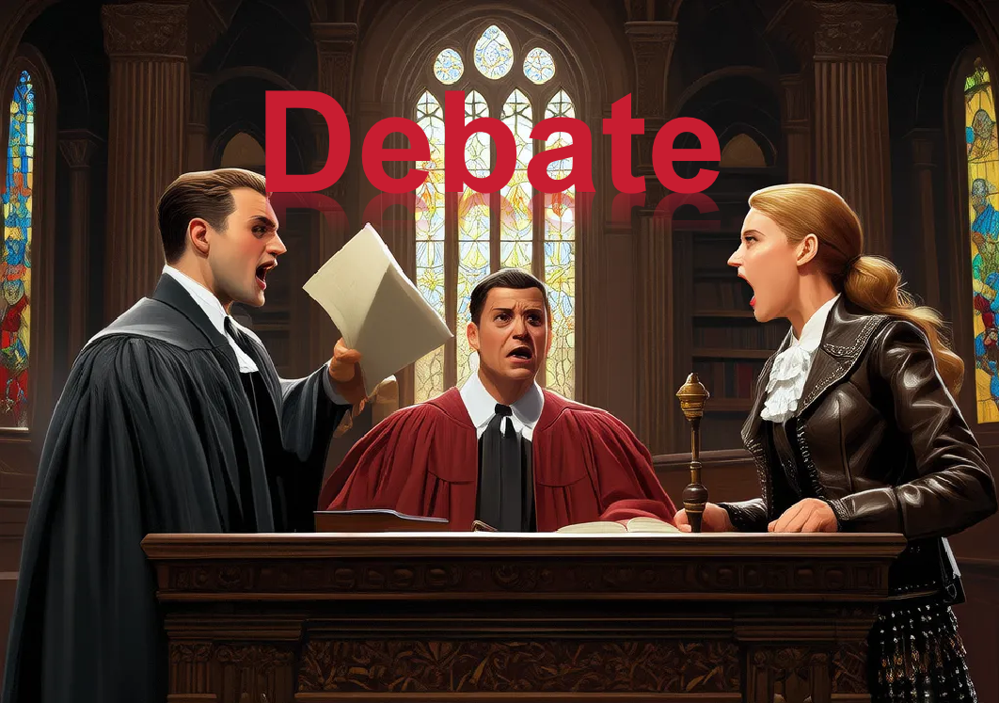
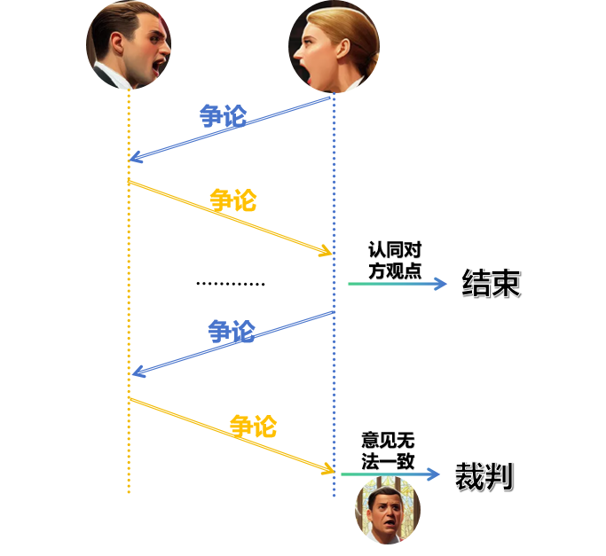
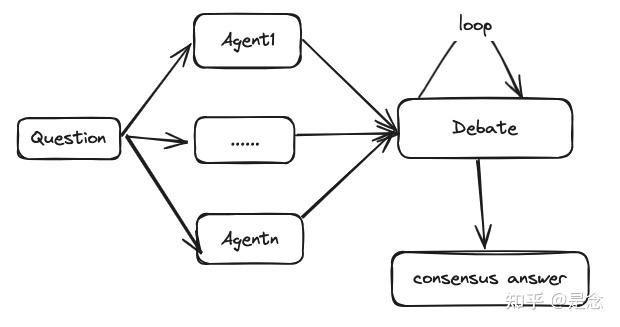

<div align="center">
  
</div>


<h2 align="center" style="font-family: 'Segoe UI', Tahoma, Geneva, Verdana, sans-serif; color: #2c3e50; font-size: 2.5em; margin-top: 40px;">
  <span style="color: #e74c3c;">⚖️</span> <strong style="color: #2c3e50;">DebateNet</strong>
</h2>
<p align="center" style="font-family: 'Helvetica Neue', Helvetica, Arial, sans-serif; font-size: 1.2em; color: #555; max-width: 800px; margin: 0 auto 40px;">
  ——Multi-Agent Debate Framework Based on Large Language Models
</p>

## English| [简体中文](README_zh-CN.md) 

### ⚖️MAD Framework (Multi-Agent Debate): An Innovative Approach

The MAD framework (Multi-Agent Debate) is a recently introduced innovative structure that simulates how humans approach and refine truths amidst differing viewpoints through argumentation and revision. This is achieved by establishing an interactive and adversarial multi-agent dialogue mechanism, aiming to explore how Large Language Models (LLMs) develop structured reasoning and self-corrective abilities in complex reasoning tasks.

As the famous quote goes:
>
> "Truth emerges from the clash of adverse ideas."
>

### Brief Introduction

In recent years, with the continuous enhancement of large language models' capabilities in natural language understanding and generation, their cognitive and behavioral performances have sparked widespread research interest. For instance, "self-reflection" as a significant metacognitive ability refers to the process where individuals introspect, evaluate, and adjust their own thought processes. Existing studies have shown that LLMs can exhibit behaviors similar to "self-reflection," improving their reasoning accuracy and consistency across various complex NLP tasks.

However, research also indicates that relying solely on a single model's internal reflection mechanism often has limitations. When models fall into inherent biases, logical loops, or reasoning degradation (such as the "**Degeneration of Thoughts, DoT**" problem), errors are hard to identify and may be reinforced due to the lack of external perspective challenges and feedback, leading to a decline in reasoning quality. These limitations manifest in several aspects:

- 1. **Bias and Distorted Cognition**🤔
The self-reflection process might be influenced by preconceived notions, cognitive biases, or irrational thinking patterns. If an agent fails to recognize and correct these biases during the reasoning process, its reflective outcomes could deviate from facts, potentially exacerbating erroneous conclusions.

- 2. **Rigidity and Resistance to Change**😬
When confronted with new information or different viewpoints, an individual (or agent) may overly adhere to existing beliefs, hindering cognitive updates and corrections. By introducing a debate mechanism among multiple agents, one agent's entrenched positions can be challenged and supplemented by another's perspectives, fostering more flexible and open-minded evolution of thoughts💪.

- 3. **Lack of External Feedback**🧐
Self-reflection is inherently an introspective process that enhances cognitive depth but relies heavily on whether the individual possesses adequate metacognitive skills. External feedback can offer new perspectives, uncover blind spots, and help identify flaws in one's reasoning. Ignoring this step may cause agents to miss critical alternative solutions and critical opinions, thereby limiting their cognitive breadth and accuracy.

Traditional reflection mechanisms based on a single model easily encounter bottlenecks in complex reasoning tasks. Therefore, the MAD framework was proposed - by introducing a novel debating mechanism between multiple agents, enabling models to continuously correct errors, break down fixed mindsets, and gradually approach better solutions through multi-angle arguments. This method not only enhances the model's reasoning robustness but also provides new insights for building more interactive and critical artificial intelligence systems.


<div align="center">
    
    <p class="image-caption">Figure 1: Comparison between debate and reflection.</p>
</div>

Through the dynamic博弈 (game-theoretic) and mutual supervision mechanism formed among multiple agents in the proposed MAD framework (Multi-Agent Debate), the system exhibits behavior patterns similar to "tit-for-tat" 🔄⚖️. This mechanism has the following key characteristics:

- **Reasoning biases or cognitive distortions** 🤯 that may exist in one agent can be identified and corrected ✅ by other agents;  
- The tendency of individuals to resist cognitive updates 😬 can be mitigated 💪 through continuous challenges and guidance from other agents;  
- Agents can provide **diversified external feedback** 🔄💡, thereby enriching the overall reasoning process.

These features make the MAD framework less prone to the "**Degeneration of Thoughts (DoT)**" problem compared to self-reflection mechanisms in single models 🚫🌀, while also more effectively stimulating and tapping into the reasoning potential of LLMs 🧠⚡.

Experimental results show that MAD has achieved significant and stable performance improvements in tasks such as **Counterintuitive QA** ❓🧠 and **Commonsense Reasoning Multi-Task (Commonsense-MT)** 📈✨!

### 框架
<div align="center">
    
    <p class="image-caption">Figure 2: flowchart</p>
</div>


## run

**Preparation**

  ```shell
  pip3 install -r requirements.txt
  ```

* In the `interactive.py` file, set the secret key for silicon-based flow, and execute the interactive script: 

```shell
python3 interactive.py
```
---

## Main Results  
#### 1. Open-ended Topics: 

<span style="color: #e74c3c; font-weight: bold; font-size: 1.2em;">示例1. 中国股市在2025年下半年会有起色</span>


<details>
<summary><b>Debate Process</b></summary>

: 通过工具检索相关中国股市的信息
```markdown
根据搜索到的信息，有多家机构对未来中国股市持有积极看法，也有一些悲观预测。以下是综合分析：

### 积极观点
- **中信建投证券**：预计2025年下半年A股市场受益于弱美元、政策支持和流动性改善，震荡中枢将上移。
- **陈果**：建议投资者关注“震荡慢牛”格局，市场调整时可加仓优质资产。
- **中金公司**：认为市场底部已现，投资者风险偏好有望提升，结构性机会增加。

### 悲观观点
- **摩根士丹利**：若关税战升级，政策刺激可能加剧产能过剩，预计2025年GDP增速4.2%，房价或下跌10%。
- **摩根士丹利补充**：关税上升将拖累出口和制造业投资，工资增长难以抵消失业率下降带来的影响。

### 综合分析
中国股市能否在2025年下半年有起色，取决于外部贸易环境、政策支持、市场流动性和消费需求等多重因素。建议关注政策力度、消费增长和国际贸易环境的变化，结合实际数据做出判断。
```

<p align="right">
</p>

```markdown
我持保留态度。虽然有积极因素，但中国股市2025年下半年能否回暖仍需谨慎。主要质疑点：

1. **外部贸易环境**：关税和贸易摩擦的不确定性可能影响出口和经济增长。
2. **国内消费需求**：房地产调控下，居民可支配收入和消费能力受限。
3. **政策刺激效果**：政策刺激效果存在不确定性，若需求不足，效果有限。

建议持续关注全球经济、贸易关系和政策执行效果。
```

: 进行第二轮辩论
```markdown
理解您的观点，补充几点反驳：

1. **外部贸易环境**：中美关税缓和意愿已反映在股市，政策支持增强市场信心。
2. **国内消费需求**：政府推出刺激政策，五一假期消费数据表现良好，消费韧性仍在。
3. **政策刺激效果**：以往政策刺激在经济低迷期取得成效，中国有较大政策空间。
4. **新兴产业**：人工智能、新能源等行业发展迅速，有望带动经济增长。

综上，虽有不确定性，但政策和新兴产业等因素为股市带来积极信号，持谨慎乐观态度。
```
<p align="right">
</p>

```markdown
我仍持保留态度，补充反驳：

1. **贸易环境**：贸易不确定性依然存在，未来摩擦可能影响市场信心。
2. **消费需求**：刺激政策短期有效，但长期消费能力受收入和房地产影响。
3. **政策效果**：政策刺激难以根本解决结构性问题，长期效果有限。
4. **新兴产业**：短期内对整体经济贡献有限，仍面临技术和市场挑战。

因此，仍需谨慎看待2025年下半年股市走势。
```

: 进行第三轮辩论
```markdown
针对您的反驳，补充几点：

1. **贸易环境**：国际社会期待中美缓和，人民币国际化可部分抵消美元影响。
2. **消费需求**：社会保障和消费政策有助于长期消费增长，餐饮和在线消费表现良好。
3. **政策效果**：政策推动产业升级，长期有助于经济结构优化。
4. **新兴产业**：政策支持下新兴行业进展快，未来有望成为增长点。

综上，政策、消费和新兴行业等因素有助于股市恢复，2025年下半年具备一定上涨潜力。
```
<p align="right">
</p>
 
```markdown
依然持保留态度，补充理由：

1. **贸易环境**：全球局势复杂，贸易争端和资本流动限制仍存不确定性。
2. **消费需求**：房地产调控影响居民收入，消费刺激政策长期效果有限。
3. **政策效果**：政策执行和成效仍需时间验证，长期效果存在变数。
4. **新兴产业**：技术和市场挑战大，短期内对经济贡献有限。

综上，积极因素虽有，但不确定性依然较大，需谨慎对待2025年下半年股市表现。
```

: 已达到最大辩论次数，裁判做出裁决
```markdown
综合双方观点，认为中国股市2025年下半年具备一定上涨潜力，主要得益于政策支持、消费韧性和新兴行业发展。但外部环境和政策效果仍存不确定性，需持续关注相关动态。
```

</details>


---

<span style="color: #e74c3c; font-weight: bold; font-size: 1.0em;">示例2. 传说中，古希腊英雄忒修斯乘坐的船被保存下来，随着时间推移，船上所有木板和零件都被逐渐替换成了新的。最终，这艘船已经没有任何一块原始的木板还保留在原位。问题：这艘船还是原来的那艘“忒修斯之船”吗？如果有人把所有换下来的旧木板重新组装成一艘船，那么哪一艘才是真正的“忒修斯之船”？</span>

<details>
<summary><b>Debate Process</b></summary>

: 第一轮辩论
```markdown
这是一个经典的哲学问题，涉及实体身份和变化的本质。忒修斯之船的问题挑战了我们对身份和连续性的理解。

### 原船的原貌
- **主要观点**：根据物体的物理组成部分，这艘船已经不再包含任何原始的木板，因此不再是原来的那艘船。站在这一角度，随着所有旧木板的更换，我们可以说这艘船和最初的那一艘已经完全不同了。
- **逻辑依据**：物体的连续性依赖于其组成部分的保留。一旦所有初始组成元素被替换，就很难再称其为原来那同一物体。

### 重建之船的意义
- **主要观点**：如果把所有旧木板重新组装成一艘新的船，那么这艘新船能够被视为“忒修斯之船”的一种重新表现或实例，因为它是由旧船的原始材料重新组建而成。
- **逻辑依据**：虽然结构和时间上这两艘船有本质差别，但作为一个整体，重建的船可以被视为忒修斯船原本形式的一个忠实复制品。这也引发这个问题的另一个层面，即是否是由相同材料重新组装的船被视为同一形态。

### 性质与连续性
- **原船不再**：从物理组成不变的角度来说，忒修斯之船已不是原来的样子。
- **新船视为同一体**：从材料相同的角度，新船可以被视为忒修斯船的延续和重新发生。

### 结论
由于传统逻辑强调的是可视性的物质组成部分，重建的那艘船可以从材料角度称为忒修斯之船，而原本的那艘船已经不再符合原有定义。换句话说，在严格的物理意义上，它不再是忒修斯之船；但从材料的角度看，可以认为是忒修斯之船的延续，或者说，两者都可代表某种时期的忒修斯之船。

为了找出更多哲学文献的讨论，我会进行一些搜索。

```

<p align="right">
</p>

```markdown
我理解你的论点，但我认为还有一种更为细致的观点，它从**不完全依赖物理构成**的角度出发，对由此得出的结论提出了挑战。

识别连续性而非变化
主要观点：不仅仅关注物理组成，还应考虑忒修斯之船作为一个社会和文化象征的意义。从身份的角度看，忒修斯之船是否仍然被视为同一艘船，很大程度上取决于它在历史叙述中的连续性和大家对它的理解。
逻辑依据：同样的材料可以组装成多艘不同的船，但如果这些船都附带同一个传奇故事的连续性，我们通常还是会将原船继续视为同一艘船。这才是真正决定它身份的关键所在。
历史和文化意义
原船含义更多：由于时间的延续性和社会记忆的存在，原有的忒修斯之船在人们的头脑中和传说中仍然是具有重要意义的。即便其物理状态发生了变化，但作为一个文化符号和历史领导者来源，它依然是最初的那一艘。
重建之船身份模糊：新组装的船，虽然物理上是用旧木板建成的，但缺乏原船在人们心中的连续性和故事线。因此，从文化和历史的意义上，新组装的船可能更像是一种替代品，而不能等同于原船。
结论
忒修斯之船的身份问题，不是单纯由物理材料组成来决定的。社会文化和历史记忆同样扮演了重要角色。因此，在实际上，严格意义上的忒修斯之船依然是原来那个，即使其物理结构已经只是历史的影子。重建的船尽管材料相同，但其身份并不能完全取代原船。

```

: 进行第二轮辩论
```markdown

根据搜索结果，我们可以进一步分析：

纯粹物理连续性：这一观点强调，忒修斯之船的身份应该影响其在历史和连续性方面。普罗泰戈拉斯认为如果所有原始木板都已经被更换了，船上没有一块原始木质，船舶的本质已经改变，很难将其视为完全同一的物体。

历史和连续性：历史上，忒修斯之船作为一种象征或故事，在人们的记忆和叙述中没有完全消失，因此它在文化和历史的视域中依然是被视为同一艘船。如霍布斯所说，保留其历史上的“有意义痕迹”，能确保船只的身份性质得以延续。

哲学悖论的现代讨论：庞德埃娃和另一位博文中提到该悖论虽然古老，但它至今仍有意义，着重讨论在身份与时间中的关系。从柏拉图到霍布斯，不同的哲学家提出了多样化的观点。

新颖反驳观点
严格物理不变性：从科学经验主义视角来看，任何物理个体都是由具体物质和状态构成，忒修斯之船若经历完全的物理替换，它将不再是原来的那艘船。这种角度强调了本质上的连续性需依赖物理材料而非仅限于记忆和叙事上的地连续。

历史记忆的局限性：即便社会记忆将重建的船视为忒修斯之船的延续，也说明连续性更多是主观建构。历史和关键修为过程中的细节改变无法通过简单的重建恢复，因此这和原船之间存在根本差异。

哲学性辩论补充：哲学家论述方向不同，强调身份需要条件和框架。如果物理状态更强调真实性（而不仅仅是相似或具有传说），重建船与原船本质上有分歧。原船代表初始构建到减少直至完全替换的全过程，而新船只是基于记忆的复制品，反映了原船故事而非全貌。

新视角总结
仅从历史记忆角度来看，我们可以把新组装的船视为忒修斯之船的重构，虽然这种重构在实物上是重复使用旧材料。但在严格物理连续性的视角下，无法认为重建的船是同一艘船。组成一部完整的忒修斯之船不仅取决于重建材料，重要的是整个历史和当时的组成过程。因此，如果严格要求持续的连续性，忒修斯之船应是其原始形态，而不是通过现有技术复原的版本。

总结而言，忒修斯之船的真实性，从科学和哲学的严格意义上讲，应遵循初始构成过程，而不是通过记忆重建。
```
<p align="right">
</p>

```markdown
### 综合反驳观点总结

1. **记忆和文化认同的重要性**：
   - **主要观点**：对于像人类这样的有意识存在物，身份认同可以取决定于心理连续性而非单纯的物质量连续性。重建的船只虽然物理材料被全部更换，但只要人们普遍认为它仍然承载着忒修斯的故事和意义，它就可以被视为同一艘船的一部分延续。
   - **逻辑依据**：记忆和社会认同对个人身份认同具有重要影响。即使物理材料完全被替换，只要故事和意义继续被传承，重建的船只就能被视为同一艘船的部分延续。

2. **连续性的动态性**：
   - **主要观点**：忒修斯之船在每一次材料更换中都在重新定义和诠释，每一次更换都是一种新的表达。重建的船只不仅是原有船只的一部分，也是具有独立意义的新船，两者共同构成了整个历史连续性的一部分。
   - **逻辑依据**：从哲学角度看，身份和连续性是动态且多维的。忒修斯之船的故事和意义在每一次更换中继续传递和发展，重建的船只作为这一过程的一部分，自然继承了原有意义的一部分。

3. **实际应用和哲学意义的双重认同**：
   - **主要观点**：从实际应用来看，重建的船只承载了忒修斯的故事和精神；从哲学意义来看，它代表了变化和连续性的共同体现。因此，在历史和文化层面上，重建的船只可以被视为忒修斯之船的一种延续。
   - **逻辑依据**：忒修斯之船悖论揭示了身份和变化的复杂关系，强调记忆和文化连续性的重要性。重建的船只在文化和实际两个层面上都是同一艘船的一部分延续，它在继承原有意义的同时，也承载着新的历史故事。

### 结论
从综合的角度来看，忒修斯之船的身份认定不仅依赖于物理连续性，更重要的是记忆和文化认同的连续性。因此，重建的船只不仅可以被视为同一艘船的一部分，还可以被视为新的诠释和延续。重建的船只在文化和实际两个层面上都是同一艘船的一部分延续，它在继承原有意义的同时，也承载着新的历史故事。


```

: 进行第三轮辩论
```markdown
### 新颖的反对观点：纯粹物理连续性与文化认同的界限

虽然记忆和社会认同对个体身份具有重要影响，但在忒修斯之船这个哲学悖论的讨论中，单纯的文化认同并不能完全替代物理连续性的要求。忒修斯之船的核心问题在于探讨身份的连续性，即一个实体在经历时间推移和变化后是否还能被视作原来的同一实体。

1. **纯粹物理连续性的要求**：
   - **主要观点**：根据严格的物质连续性标准，忒修斯之船的每一部分都在不断更换，最终整个船只都已没有原始材料。因此从纯粹物质的角度来看，重建的船只不能被视为原始的忒修斯之船。
   - **逻辑依据**：物理连续性是确定一个物体在时间上的同一性的基础。如果所有物理组成都已被彻底替换，那么从科学和哲学的角度来看，这艘船已经是完全不同的实体了。

2. **文化记忆的社会构造性**：
   - **主要观点**：虽然人们可以通过文化记忆和社会认同继续把重建的船只视为忒修斯之船的一部分，但这只是在文化层面上的一种认同，并不能改变船在物质上的本质变化。
   - **逻辑依据**：身份认同和文化记忆虽然有重要价值，但在科学和哲学的角度，它们不能改变一个物体在其原子构成上的根本改变。忒修斯之船不仅是一个历史故事，也是一个有具体物理形态的存在，其身份定性更应基于其物理构成而非单纯的文化认同。

3. **历史和文化记忆的局限性**：
   - **主要观点**：虽然文化记忆和社会认同可以赋予重建的船只以新的意义，但这并不能改变其物理上的根本变化。重建的船只只是通过对原始材料的复用来进行的一种身份象征或故事延续，而不是同一艘具有完整原始材料的船只。
   - **逻辑依据**：从哲学角度看，身份和连续性是多维的，但纯物理连续性的要求是不可忽视的。忒修斯之船的每一部分都被更换，因此其物理上的同一性被完全破坏。

综上所述，忒修斯之船的身份定性最终还是依赖于其物理构成。即使可以从文化记忆和社会认同的角度赋予重建的船只某种形象和意义，但在严格的物理连续性要求下，重建的船只不能被视为原来的那一艘忒修斯之船。


```
<p align="right">
</p>
 
```markdown
### 新颖的反对观点：纯粹物理连续性与文化认同的界限

虽然纯粹物理连续性的要求在严格意义上认为重建的船只不能被视为原来的忒修斯之船，但我们不能忽视记忆和社会认同在身份认同中的重要性。忒修斯之船悖论不仅仅是一个关于物理连续性的讨论，它的核心议题在于探讨身份及同一性在不同条件和情境下的多维度表达。

1. **纯粹物理连续性的局限性**：
   - **主要观点**：虽然还原的船只在物理上已经不存在原来的材料，但这种变化并不代表它在身份上的丧失。通过文化记忆和社会认同，我们可以依然将它视为忒修斯之船的一部分。
   - **逻辑依据**：身份认同在很多情况下是社会和文化共同定义的。即便所有物理材料都被替换，如果人们继续相信它在文化和故事层面上仍然是那艘船，那么它仍然承载着忒修斯所代表的意义。

2. **文化记忆的社会构造性**：
   - **主要观点**：文化和记忆的传承在许多历史和故事中起着重要作用。重建的船只虽然物理上不是原来的那一艘，但它所承载的故事和意义能够让它在新的状态下成为忒修斯之船的一部分。
   - **逻辑依据**：记忆和社会认同在我们对于历史和文化故事的理解中是不可分割的部分。即便物体本身的构成发生变化，只要故事和记忆保持连贯，那么这些变化依然可以被视为连续性的见证。

3. **历史和文化记忆的延续性**：
   - **主要观点**：从历史的角度来看，忒修斯之船的每一部分被更换，不仅仅是材料的更新，而是文化记忆的一种延续。即使新材料被使用，只要这些材料能够承载和传递原有的故事，那么重建的船体就仍然可以视为同一艘船的一部分。
   - **逻辑依据**：身份认同常常依赖于记忆和社会认同的连续性。重建的船只虽然物理上不是原来的材料，但在文化层面它仍然代表了连续的历史和故事，这意味着它的身份在文化上依然是连续的。

### 综合反驳观点

从综合的角度来看，纯粹的物理连续性要求虽然在严格的科学和哲学层面对忒修斯之船的身份认定有所限制，但不能忽视记忆和社会认同在文化认同中的核心作用。忒修斯之船不仅仅是一个具体的物理存在，更是一个文化和社会记忆的符号。通过理解记忆和社会认同的重要性，我们可以认识到重建的船只虽然在物理上不再与原来的忒修斯之船相同，但在文化和故事层面上依然可以被视为同一艘船的一部分延续。

```

: 已达到最大辩论次数，裁判做出裁决：Negative获胜，并根据Negative的观点给出最终结果
```markdown

从纯粹物理连续性的角度来看，这艘船已经不再被视为原来的忒修斯之船，因为所有的木板和零件都被替换成了新的。然而，从文化和记忆的角度来看，这艘船仍然可以被视为忒修斯之船的一部分。因为即使所有物理材料都被替换，如果人们继续相信它在文化和故事层面上仍然是那艘船，那么它仍然承载着忒修斯所代表的意义。

如果有人把所有换下来的旧木板重新组装成一艘船，那么这艘重新组装的船在物理上与原来的忒修斯之船相同，但它是否被视为忒修斯之船则取决于文化记忆和社会认同。如果人们认为这艘重新组装的船承载了同样的故事和意义，那么它也可以被视为忒修斯之船的一部分。然而，从严格的物理连续性角度来看，这艘重新组装的船仍然是新组装的，而不是原来的那艘船。

因此，忒修斯之船的身份认定不仅仅依赖于物理上的连续性，还依赖于文化和记忆的连续性。这两者共同作用，使得这艘船在文化和故事层面上仍然可以被视为忒修斯之船的一部分。

```

</details>


---

#### 2、逻辑推理

<span style="color: #e74c3c; font-weight: bold; font-size: 1.0em;">示例1. 当爱丽丝上山时，她的速度是 1 米/秒；当她下山时，速度是 3 米/秒。那么当爱丽丝上山再下山一个来回时，她的平均速度是多少？（"3/2", "1.5"）</span>


<details>
<summary><b>Debate Process</b></summary>

: 
```markdown

要计算爱丽丝上山再下山的**平均速度**，我们首先需要确定她整个旅程的**总距离**和**总时间**。

假设上山和下山的距离相同（记为 $d$）：

### 1. **上山所用时间：**
$$
t_{\text{up}} = \frac{d}{\text{speed}_{\text{up}}} = \frac{d}{1 \, \text{m/s}} = d \, \text{秒}
$$

### 2. **下山所用时间：**
$$
t_{\text{down}} = \frac{d}{\text{speed}_{\text{down}}} = \frac{d}{3 \, \text{m/s}} = \frac{d}{3} \, \text{秒}
$$

### 3. **总距离：**
$$
\text{总距离} = d + d = 2d \, \text{米}
$$

### 4. **总时间：**
$$
\text{总时间} = t_{\text{up}} + t_{\text{down}} = d + \frac{d}{3} = \frac{4d}{3} \, \text{秒}
$$

### 5. **平均速度：**
$$
\text{平均速度} = \frac{\text{总距离}}{\text{总时间}} = \frac{2d}{\frac{4d}{3}} = \frac{2d \times 3}{4d} = \frac{6}{4} = 1.5 \, \text{米/秒}
$$

---

因此，爱丽丝上山再下山的平均速度是 **1.5 米/秒**。

这个计算不依赖于 $d$ 的具体数值，无论距离是多少，这种方法都适用。你可以直接使用这个公式进行计算，无需查找额外信息来验证结果。

```

<p align="right">
</p>

```markdown
同意
```

:双方达成一致意见
```markdown
爱丽丝上山再下山的平均速度是 **1.5 米/秒**。
```

</details>


### 参考项目
- **Multi-Agents-Debate**:<a href="https://github.com/Skytliang/Multi-Agents-Debate"> 基础框架基于Multi-Agents-Debate</a>
- **DSPy**: https://github.com/stanfordnlp/dspy
- **Pydantic_ai**: https://ai.pydantic.org.cn/

### 参考文献

- **0-Shot CoT**: <a href="https://arxiv.org/pdf/2205.11916.pdf">Large Language Models are Zero-Shot Reasoners</a> (NeurIPS 2022)
- **Self-Consist**: <a href="https://openreview.net/pdf?id=1PL1NIMMrw">Self-Consistency Improves Chain of Thought Reasoning in Language Models</a> (ICLR 2023)
- **Self-Reflect**: <a href="https://arxiv.org/pdf/2303.11366.pdf">Reflexion: an autonomous agent with dynamic memory and self-reflection</a> (arxiv 2023)
- **MAPS**: <a href="https://arxiv.org/pdf/2305.04118.pdf">Exploring Human-Like Translation Strategy with Large Language Models</a> (arxiv 2023)
- **Multi-Agent Debate**:<a href="https://arxiv.org/abs/2406.11776
">Improving Multi-Agent Debate with Sparse Communication Topology</a> (arxiv 2024)

