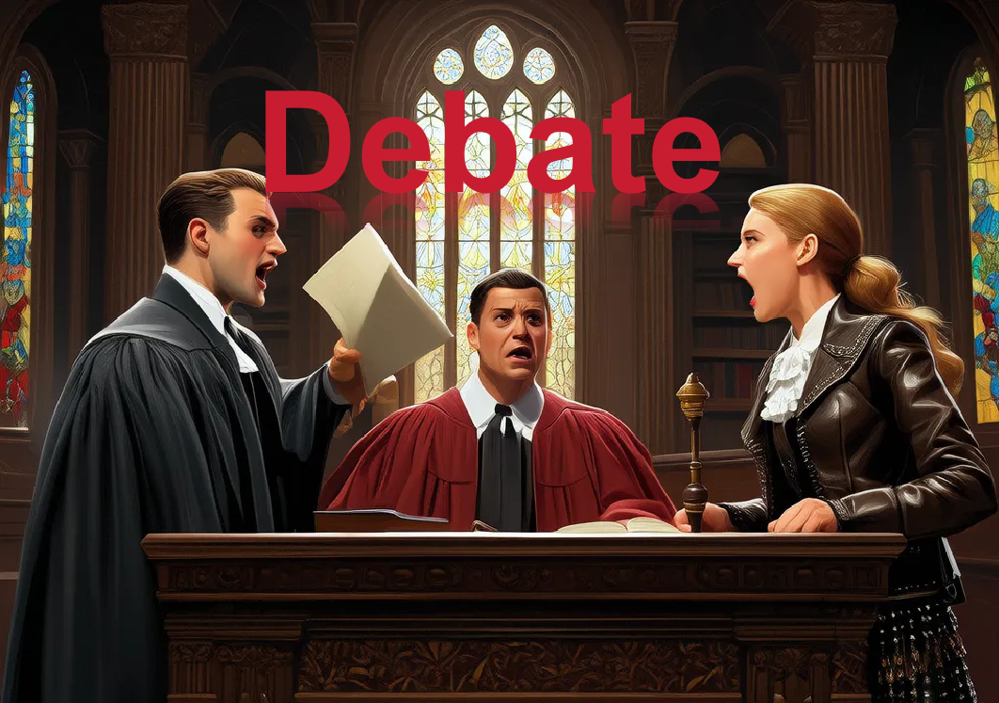
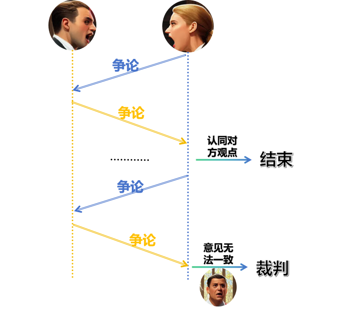

<div align="center">
  
</div>

<h2 align="center" style="font-family: 'Segoe UI', Tahoma, Geneva, Verdana, sans-serif; color: #2c3e50; font-size: 2.5em; margin-top: 40px;">
  <span style="color: #e74c3c;">âš–ï¸</span> <strong style="color: #2c3e50;">DebateNet</strong>
</h2>
<p align="center" style="font-family: 'Helvetica Neue', Helvetica, Arial, sans-serif; font-size: 1.2em; color: #555; max-width: 800px; margin: 0 auto 40px;">
  ——基äºå¤§è¯­è¨€æ¨¡å‹å¤šæ™ºèƒ½ä½“辩论框æ¶
</p>


âš–ï¸MAD框æ¶ï¼ˆMulti-Agent Debate）是近期æ出的一个新颖框æ¶ï¼Œé€šè¿‡æ„建一个具有交互性和对抗性的多智能体对è¯æœºåˆ¶ï¼Œæ¨¡æ‹Ÿäººç±»åœ¨é¢å¯¹ä¸åŒè§‚点时如何通过争论ä¸ä¿®æ­£ä¸æ–­é€¼è¿‘真ç†ã€‚以æ¢ç´¢å¤§å‹è¯­è¨€æ¨¡å‹ï¼ˆLLMs）在å¤æ‚æ¨ç†ä»»åŠ¡ä¸­é€æ­¥å‘展出的结æ„化æ¨ç†ä¸è‡ªæˆ‘修正能力。

正如那å¥å言所说：
>
> "Truth emerges from the clash of adverse ideas."
>
> "真ç†ä»å¯¹ç«‹è§‚点的交锋中浮ç°"
>

### 简è¦ä»‹ç»

近几年，éšç€å¤§å‹è¯­è¨€æ¨¡å‹åœ¨è‡ªç„¶è¯­è¨€ç†è§£ä¸ç”Ÿæˆæ–¹é¢çš„能力ä¸æ–­å¢å¼ºï¼Œå…¶åœ¨è®¤çŸ¥è¡Œä¸ºå±‚é¢çš„表ç°ä¹Ÿå¼•å‘了广泛的研究兴趣。例如，“自我åæ€ï¼ˆself-reflection）â€ä½œä¸ºä¸€ç§é‡è¦çš„元认知能力，通常指个体对自身æ€ç»´è¿‡ç¨‹è¿›è¡Œå†…çœã€è¯„ä¼°ä¸è°ƒæ•´çš„过程。已有研究表æ˜ï¼ŒLLMs 在多ç§å¤æ‚çš„ NLP 任务中也能表ç°å‡ºç±»ä¼¼â€œè‡ªæˆ‘åæ€â€çš„行为，ä»è€Œæå‡å…¶æ¨ç†å‡†ç¡®æ€§ä¸ä¸€è‡´æ€§ã€‚

然而，已有研究表æ˜ï¼Œä»…ä¾èµ–å•ä¸€æ¨¡å‹çš„内部åæ€æœºåˆ¶å¾€å¾€å­˜åœ¨å±€é™ã€‚当模å‹é™·å…¥å›ºæœ‰åè§ã€é€»è¾‘循ç¯æˆ–æ¨ç†é€€åŒ–（如“**æ€ç»´é€€åŒ–（Degeneration of Thoughts, DoT）**â€é—®é¢˜ï¼‰æ—¶ï¼Œç”±äºç¼ºä¹æ¥è‡ªå¤–部视角的质疑ä¸å馈，错误ä¸ä»…难以被识别，å而å¯èƒ½è¢«ä¸æ–­å¼ºåŒ–，ä»è€Œå¯¼è‡´æ¨ç†è´¨é‡ä¸‹é™ã€‚è¿™ç§å±€é™æ€§ä¸»è¦ä½“ç°åœ¨ä»¥ä¸‹å‡ ä¸ªæ–¹é¢ï¼š

- 1. **åè§ä¸æ‰­æ›²çš„认知**🤔
自我åæ€è¿‡ç¨‹å¯èƒ½å—到先入为主的观念ã€è®¤çŸ¥å差或éç†æ€§æ€ç»´æ–¹å¼çš„å½±å“。如æœä¸€ä¸ªæ™ºèƒ½ä½“在æ¨ç†è¿‡ç¨‹ä¸­æœªèƒ½è¯†åˆ«å¹¶çº æ­£è¿™äº›åè§ï¼Œå…¶åæ€ç»“æœå¯èƒ½ä¼šå离事å®ï¼Œç”šè‡³è¿›ä¸€æ­¥åŠ å‰§é”™è¯¯ç»“论的形æˆã€‚

- 2. **僵化ä¸æŠ—拒改å˜**😬
个体（或智能体）在é¢å¯¹æ–°ä¿¡æ¯æˆ–ä¸åŒè§‚点时，å¯èƒ½è¡¨ç°å‡ºå¯¹æ—¢æœ‰ä¿¡å¿µçš„过度åšæŒï¼Œé˜»ç¢è®¤çŸ¥æ›´æ–°ä¸ä¿®æ­£ã€‚通过引入多个智能体之间的辩论机制，一个智能体的固有立场å¯ä»¥è¢«å¦ä¸€ä¸ªæ™ºèƒ½ä½“的观点挑战ä¸è¡¥å……，ä»è€Œä¿ƒè¿›æ›´çµæ´»ã€å¼€æ”¾çš„æ€ç»´æ¼”化💪。

- 3. **缺ä¹å¤–部å馈**ğŸ§
自我åæ€æœ¬è´¨ä¸Šæ˜¯ä¸€ç§å†…çœè¿‡ç¨‹ï¼Œè™½ç„¶æœ‰åŠ©äºæå‡è®¤çŸ¥æ·±åº¦ï¼Œä½†å…¶æœ‰æ•ˆæ€§é«˜åº¦ä¾èµ–äºä¸ªä½“是å¦å…·å¤‡è¶³å¤Ÿçš„元认知能力。而外部å馈则能æ供新的视角ã€æ­ç¤ºç›²ç‚¹ï¼Œå¹¶å¸®åŠ©è¯†åˆ«è‡ªèº«æ¨ç†ä¸­çš„æ¼æ´ã€‚若忽视这一ç¯èŠ‚，智能体很å¯èƒ½é”™å¤±å…³é”®çš„替代æ€è·¯ä¸æ‰¹åˆ¤æ€§æ„è§ï¼Œè¿›è€Œé™åˆ¶å…¶è®¤çŸ¥å¹¿åº¦ä¸å‡†ç¡®æ€§ã€‚

传统基äºå•ä¸€æ¨¡å‹çš„åæ€æœºåˆ¶åœ¨å¤æ‚æ¨ç†ä»»åŠ¡ä¸­å®¹æ˜“é­é‡ç“¶é¢ˆã€‚因此，æ出了 MAD 框æ¶â€”—通过引入多个智能体之间的辩论新颖机制，使模å‹èƒ½å¤Ÿåœ¨è§‚点交锋中ä¸æ–­ä¿®æ­£é”™è¯¯ã€æ‰“ç ´æ€ç»´å®šå¼ï¼Œå¹¶å€ŸåŠ©å¤šè§’度的论è¯é€æ­¥æ¥è¿‘更优解。该方法ä¸ä»…æå‡äº†æ¨¡å‹çš„æ¨ç†é²æ£’性，也为æ„建更具互动性ä¸æ‰¹åˆ¤æ€§çš„人工智能系统æ供了新的æ€è·¯ã€‚

<div align="center">
    
    <p class="image-caption">Figure 1: Comparison between debate and reflection.</p>
</div>

通过所æ出的 MAD 框æ¶ï¼ˆMulti-Agent Debate）的多个智能体之间形æˆä¸€ç§åŠ¨æ€åšå¼ˆä¸ç›¸äº’监ç£çš„机制，呈ç°å‡ºç±»ä¼¼â€œä»¥ç‰™è¿˜ç‰™â€ï¼ˆtit-for-tatï¼‰çš„è¡Œä¸ºæ¨¡å¼ ğŸ”„âš–ï¸ã€‚这一机制具有以下关键特性：

- 一个智能体å¯èƒ½å­˜åœ¨çš„æ¨ç†å差或认知扭曲 🤯，能够被其他智能体识别并纠正 ✅；
- 个体对认知更新的抗拒倾å‘😬，å¯é€šè¿‡å…¶ä»–智能体的æŒç»­æŒ‘战 ä¸å¼•å¯¼å¾—以缓解💪；
- å„智能体之间å¯æ供多样化的外部å馈 🔄💡，ä»è€Œä¸°å¯Œæ•´ä½“æ¨ç†è¿‡ç¨‹ã€‚

上述特性使得 MAD 框æ¶ç›¸æ¯”å•ä¸€æ¨¡å‹çš„自我åæ€æœºåˆ¶ï¼Œæ›´ä¸å®¹æ˜“陷入“æ€ç»´é€€åŒ–â€ï¼ˆDegeneration of Thoughts, DoT）问题 🚫🌀，åŒæ—¶èƒ½å¤Ÿæ›´å……分地激å‘å’ŒæŒ–æ˜ LLMs çš„æ¨ç†æ½œèƒ½ 🧠⚡。

å®éªŒç»“æœè¡¨æ˜ï¼ŒMAD 在å直觉问答（Counterintuitive QA）â“🧠 和常识æ¨ç†å¤šä»»åŠ¡ï¼ˆCommonsense-MT）等领域中，å‡å–得了显著且稳定的性能æå‡ ğŸ“ˆâœ¨ï¼

### 框æ¶
<div align="center">
    
    <p class="image-caption">Figure 2: Framework of Multi-Agent Debate. Here we designate the devil () as the affirmative side while the angel () as the negative side. We want the angel to correct the devil’s mistakes..</p>
</div>


## Run

**Preparation**

  ```shell
  pip3 install -r requirements.txt
  ```
* Set your openai API_KEY in `interactive.py`

**Run Interactive**

如æœä½ æƒ³äº²è‡ªä½“验一下，å¯ä»¥åœ¨ä½ çš„电脑上å°è¯•è¿è¡Œè¿™ä¸ªäº¤äº’å¼è„šæœ¬ã€‚

```shell
python3 interactive.py
```

或者，你也å¯ä»¥ç›´æ¥å°è¯•æˆ‘们的翻译演示[here]().


## 主è¦ç»“æœ

### å直觉问答

<div align="center">
    
    <p class="image-caption">Table 1: Reasoning accuracy on Counter-Intuitive AR.</p>
</div>


##### Case 1

When Alice walks up the hill, her speed is 1 m/s and when she goes down the hill, her speed is 3 m/s. Then when Alice walks up and down the hill, what is her average speed? (1.5m/s)
###### MAD

<div align="center">
    
    <p class="image-caption">Figure 3: An Animation to Show the Process of MAD.</p>
</div>

<details>
<summary><b>Debate process</b></summary>

* :Alice's average speed can be calculated by adding her speed going up the hill and her speed going down the hill, and then dividing by 2. **So, (1 m/s + 3 m/s) / 2 = 2 m/s.** Therefore, Alice's average speed is 2 m/s.
* : I disagree with your answer. The problem doesn't give us any information about the distance Alice covers while going up and down the hill. **So, we cannot simply add her speeds and divide by 2 to get her average speed.** We need to know the distance she covers to calculate her average speed.
* : **The average speed is calculated by dividing the total distance by the total time taken.** As Alice walks up and down the hill, the distance covered in both directions is the same. Therefore, the total distance covered is 2 times the distance of either direction.
* : That's a good point. But we can assume that Alice covers the same distance going up and down the hill. In that case, we can use the formula for average speed, which is total distance divided by total time. **If Alice covers a distance of d going up and down the hill, then her total distance is 2d. Her time going up the hill is d/1 = d, and her time going down the hill is d/3. So, her total time is d + d/3 = 4d/3. Therefore, her average speed is 2d/(4d/3) = 3/2 m/s.**
* : Thank you for providing your answer. This average speed of 1.5 m/s takes into account both the uphill and downhill speeds, providing a balanced representation of Alice's overall performance while walking up and down the hill.
* : Yes. Let's assume the distance is d. The time taken to walk up the hill is d/1 and the time taken to walk down the hill is d/3. The total time taken is d/1 + d/3 = 4d/3. **Therefore, the average speed is (2d)/(4d/3) = 1.5 m/s. Hence, the negative side is correct.**

</details>

<details>
<summary><b>Case 2</b></summary>
We have 1 ton apples which contain 90% water. After a few days, those apples only have 80% water. What is the weight of those apples now? (0.5ton)

###### MAD
* : First, we need to find out how much of the original weight was water. If we have 1 ton of apples with 90% water, then the weight of water in those apples is 0.9 x 1 ton = 0.9 tons.<br>
  Next, we need to find out how much of the new weight is water. If the apples now have 80% water, then the weight of water in those apples is 0.8 x new weight.

  We can set up an equation:<br>
  **0.8 x new weight = 0.9 tons**<br>
  To solve for the new weight, we can divide both sides by 0.8:<br>
  new weight = 0.9 tons / 0.8<br>
  new weight = 1.125 tons<br>
  Therefore, the weight of the apples now is 1.125 tons.

* : **It's important to note that the weight of the apples has decreased due to the loss of water, but the weight of the remaining *solids* remains the same.** This is why we need to calculate the weight of remaining solids in both scenarios to find the new weight of the apples.<br>

* : Great idea! While it is true that the water content of the apples decreases from 90\% to 80\%, the solid, non-water content of the apples does not change.<br>

* : You are correct. The weight of the apples has decreased due to the loss of water, but the weight of the remaining solids remains the same. Therefore, we need to calculate the weight of the remaining solids in both scenarios to find the new weight of the apples.

  We can set up an equation:<br>
  **0.2 x new weight = 0.1 tons**<br>
  To solve for the new weight, we can divide both sides by 0.2:<br>
  new weight = 0.1 tons / 0.2<br>
  new weight = 0.5 tons<br>
  Therefore, the weight of the apples now is 0.5 tons.

* : Thank you for your perspective. While it's true that the weight of the apples themselves hasn't changed, the overall weight of the apples with the water included has decreased. So, the weight of the apples now is 0.5 tons.

* : The negative side correctly calculated the new weight of the apples by considering the solid content as a constant and using the formula to find the new weight based on the reduced water content percentage.

</details>

---

### Commonsense Machine Translation

<div align="center">
    
    <p class="image-caption">Table 2: Translation performance on Common MT.</p>
</div>


##### Case 1
Given the Chinese sentence "åƒæ‰æ•Œäººä¸€ä¸ªå¸ˆã€‚", please provide its translation in English.

###### MAD
* : I believe the correct translation of the Chinese text "åƒæ‰æ•Œäººä¸€ä¸ªå¸ˆ" is "Eat up an enemy division.†**The word "åƒæ‰" literally means "eat up" or “consume."**
* : I disagree with your translation. I believe the correct translation of the Chinese text "åƒæ‰æ•Œäººä¸€ä¸ªå¸ˆ" is "Eliminate an enemy division.†While "åƒæ‰" can be translated as "eat up" or "consume," **it can also mean "eliminate" or "annihilate" in a military context.** In this case, it is more appropriate to use "eliminate" as it conveys the idea of completely destroying the enemy division.
* : Both sides presented valid arguments and translations that accurately convey the meaning of the original Chinese text. The choice between 'eat up' and 'eliminate' may depend on the context and tone of the text. Therefore, there is no clear preference for either side at this time.
* : While "eliminate" does convey the idea of completely destroying the enemy division, it doesn't capture the connotation of consuming or devouring the enemy that is implied by “åƒæ‰."
* : **In a military context, "åƒæ‰" is often used to describe the complete destruction of the enemy, rather than the consumption of their resources or territory.**
* : Both sides presented valid arguments, but the negative side's argument that 'eliminate' better captures the intensity and seriousness of the military language used in the original Chinese text was more convincing. Additionally, 'eliminate' accurately conveys the idea of completely destroying the enemy division. Therefore, the correct English translation of the Chinese text 'åƒæ‰æ•Œäººä¸€ä¸ªå¸ˆ' is **'Eliminate an enemy division.'**

<p align="center">

</p>


<details>
<summary><b>Case 2</b></summary>
Given the Chinese sentence "ä»–ä»åé—¨æ到了ä¸å°‘å酒。", please provide its translation in English.

###### MAD

* : The phrase “ä»å门†**literally translates to “from the back door.â€**
* : I actually disagree with your translation. I believe a more accurate translation would be "He got a lot of famous liquor from the back door. Lastly, while "ä»åé—¨" does literally translate to "from the back door," **it is a common Chinese idiom that means obtaining something through unofficial or illegitimate means**. Therefore, the use of "from the back door" in the translation is not entirely accurate. Instead, the use of "from an unofficial source" or "through unofficial means" would be more appropriate.
* : Both sides presented valid arguments and translations that accurately capture the meaning of the original Chinese text. The choice between wine and liquor is a matter of interpretation and context. **The use of from the back door versus from an unofficial source is a matter of preference and style.** Therefore, there is no clear preference for a translation candidate.
* : **I agree that "ä»åé—¨" is a common Chinese idiom that means obtaining something through unofficial or illegitimate means.** The use of "from an unofficial source" or "through unofficial means" can be more appropriate than "from the back door.â€
* : Yes, I agree with your perspective. 
* : While both translations accurately capture the meaning of the original Chinese text, the use of 'liquor' in candidate 2 is more accurate as 'åé…’' is more commonly used to refer to liquor. Additionally, the use of 'from an unofficial source' in candidate 3 more accurately conveys the connotation of 'ä»åé—¨' as obtaining something through unofficial or illegitimate means. Therefore, the correct translation is: **'He got a lot of famous liquor from an unofficial source.'**

<p align="center">

</p>

</details>

### å‚考项目
- **DSPy**: 
- **Pydantic_ai**: 
- **Multi-Agents-Debate**:<a href="https://github.com/Skytliang/Multi-Agents-Debate"> 基äºMulti-Agents-Debate框æ¶</a>


### å‚考文献

- **0-Shot CoT**: <a href="https://arxiv.org/pdf/2205.11916.pdf">Large Language Models are Zero-Shot Reasoners</a> (NeurIPS 2022)
- **Self-Consist**: <a href="https://openreview.net/pdf?id=1PL1NIMMrw">Self-Consistency Improves Chain of Thought Reasoning in Language Models</a> (ICLR 2023)
- **Self-Reflect**: <a href="https://arxiv.org/pdf/2303.11366.pdf">Reflexion: an autonomous agent with dynamic memory and self-reflection</a> (arxiv 2023)
- **MAPS**: <a href="https://arxiv.org/pdf/2305.04118.pdf">Exploring Human-Like Translation Strategy with Large Language Models</a> (arxiv 2023)
- **Multi-Agent Debate**:<a href="https://arxiv.org/abs/2406.11776
">Improving Multi-Agent Debate with Sparse Communication Topology</a> (arxiv 2024)


## Citation
```
@article{liang2023encouraging,
  title={Encouraging Divergent Thinking in Large Language Models through Multi-Agent Debate},
  author={Liang, Tian and He, Zhiwei and Jiao, Wenxiang and Wang, Xing and Wang, Yan and Wang, Rui and Yang, Yujiu and Tu, Zhaopeng and Shi, Shuming},
  journal={arXiv preprint arXiv:2305.19118},
  year={2023}
}
```


